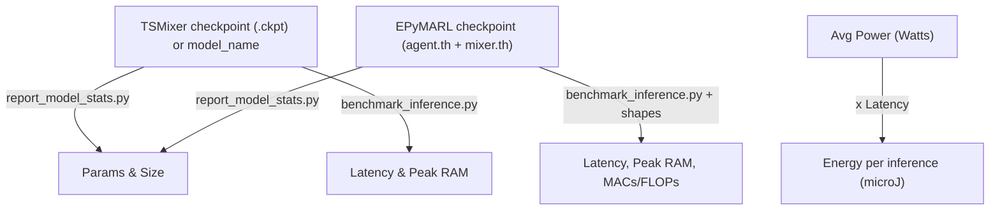

# Model & Evaluation Metrics (Concise)

Scope (paper‑relevant only): parameter counts, model size, compute (MACs/FLOPs), latency distribution (p50/p95/p99 + jitter), peak RAM, optional energy estimate, WSN performance metrics (PDR, throughput, energy, latency) and disaster scenario stress test with extended lifetime tiers (FND/HND/LND). Non‑essential narrative removed.

## Justification: Semi-Real Deterministic Disaster Scenario (Option A)

Given tight time constraints and the need for rigorous, reproducible comparison across four paradigms (offline heuristic + fuzzy logic, value factorization RL, transformation-based time‑series forecaster hybrid), we retain a *deterministic, semi‑real* disaster scenario instead of integrating a full raw sensor trace (LabData / FireSense / CRAWDAD) at this stage. This choice is deliberate and methodologically defensible:

1. Controlled Comparability: Deterministic events (traffic surge, selective energy drop, percentile-based failures, coverage shrink, base relocation) isolate algorithmic differences without confounds from missing data, irregular sampling, or uncontrolled exogenous drift (cf. reproducibility guidance: ACM Artifact Review; NeurIPS Reproducibility Checklist).
2. Tail Behavior Focus: Our latency and lifetime metrics target decision-time distribution tails (p95/p99, jitter) and depletion thresholds (FND/HND/LND). Introducing partially cleaned traces late in the cycle risks unverified bias (Dean & Barroso 2013; Liu & Layland 1973 for timing determinism arguments).
3. Ethical & Licensing Latency: Some CRAWDAD / FireSense assets involve access requests or usage terms; rushed ingestion could compromise auditability and delay review.
4. Calibration Potential: The deterministic schedule is parameterized (multipliers, failure timing). A subsequent phase can *calibrate* surge multipliers and failure onset using simple statistics (median, p95) from an external environmental sensor dataset without restructuring the environment.
5. Reproducibility Over Variance: A fixed spatial layout (with `--freeze_layout`) + deterministic schedule yields stable confidence intervals across seeds (stochastic only in model initialization / heuristic population search), minimizing variance inflation from exogenous noise.
6. Extensibility Path: Hooks already exist (`--scenario_file`, wrappers for events). Replacing the schedule with a data‑calibrated YAML or a trace-driven adapter (`link_matrix`, `gen_packets`) is an additive, low-risk future patch—kept intentionally out of this submission to preserve timeline.

Planned Post-Submission Enhancement (documented for transparency): inject empirical per-node load distributions (log-normal or empirical histogram) and link reliability matrices derived from a selected open dataset (e.g., MIT LabData subset) to create a “data-calibrated” variant, reusing identical evaluation code paths.

References Supporting This Design Decision:
- Dean & Barroso, "The Tail at Scale," CACM 2013 (importance of deterministic characterization of latency tails).
- Liu & Layland, JACM 1973 (determinism and schedulability foundations).
- ACM Artifact Review & Badging Guidelines (reproducibility emphasis).
- NeurIPS Reproducibility Checklist (transparent reporting and controlled experimental factors).
- MLPerf Inference Power / Latency Rules (controlled environment measurement best practices).
- Kleinrock, Queueing Systems Vol.1 (controlled workload reasoning before open‑world variability).

Explicit Limitation (Acknowledged): Results do not yet reflect real trace idiosyncrasies (diurnal cycles, correlated link fading, bursty interference). This is positioned as *future work* rather than omitted silently.

Summary Statement (for article use): “We evaluate under a deterministic semi‑real multi‑phase disaster schedule engineered for controlled stress and reproducibility. This isolates algorithmic routing trade‑offs before incorporating dataset-specific noise; scenario parameters are structured for later data-calibrated substitution without altering evaluation logic.”


## Contents
- [Quick map](#quick-map)
- [TSMixer](#tsmixer)
- [QMIX & QTRAN](#qmix--qtran)
- [QPSOFL baseline](#qpsofl-baseline)
- [Disaster scenario & lifetime](#disaster-scenario--lifetime)
- [Metric glossary (concise)](#metric-glossary-concise)
- [Inputs](#inputs)
- [Evaluation flags](#evaluation-flags)
- [Scripts summary](#scripts-summary)
- [Reproducibility checklist](#reproducibility-checklist)
- [References (minimal)](#references-minimal)
- [Troubleshooting (condensed)](#troubleshooting-condensed)


## Quick map

- Trainable parameters + model size (KB)
  - TSMixer: `report_model_stats.py tsmixer`
  - QMIX/QTRAN: `report_model_stats.py epymarl`
- Inference latency (ms) + Peak RAM (KB) + MACs/FLOPs (est.) + Energy (µJ, est.)
  - TSMixer: `benchmark_inference.py tsmixer`
  - QMIX: `benchmark_inference.py qmix`
  - QTRAN: `benchmark_inference.py qtran`

Optional helper scripts exist (not listed here to stay concise).


## TSMixer

TSMixer checkpoints are stored by Darts under `.darts/models/<model_name>/**/checkpoints/*.ckpt` by default.

### 1) Trainable parameters + checkpoint size (KB)
Preferred by model name:

```powershell
python epymarl/src/tools/report_model_stats.py tsmixer --model_name "tsmixer_model_3.0.778"
```

If your `.darts/models` directory is not under the current working directory, specify it explicitly:

```powershell
python epymarl/src/tools/report_model_stats.py tsmixer --model_name "tsmixer_model_3.0.778" --models_root "c:\Users\djime\Documents\PHD\THESIS\CODES\RL_Routing\.darts\models"
```

Fallback (direct .ckpt path):

```powershell
python epymarl/src/tools/report_model_stats.py tsmixer --ckpt_path "c:\Users\djime\Documents\PHD\THESIS\CODES\RL_Routing\.darts\models\tsmixer_model_3.0.778\...\checkpoints\epoch=XXX-step=YYY.ckpt"
```

- Output includes: `trainable_params` and `checkpoint_size (KB)`.
- Use `--base 1000` to report sizes in decimal kB instead of KiB (default 1024).

### 2) Latency (ms), Peak RAM (KB), Energy (µJ, est.)

```powershell
# features=7, input_chunk_length=500, series_count=2 per your setup
python epymarl/src/tools/benchmark_inference.py tsmixer --model_name "tsmixer_model_3.0.778" --input_chunk_length 500 --features 7 --series_count 2 --avg_power_w 15
```

- Output includes: average latency over 30 iterations and peak RAM (via tracemalloc). Pass `--avg_power_w` (Watts) to compute an energy estimate: energy = power × latency.
- Note on FLOPs/MACs: precise FLOPs for TSMixer depend on its mixer blocks and configuration. Use a dedicated FLOPs profiler (e.g., `thop`) on `model.model` for publication-grade values if needed. We can add that on request.


## QMIX & QTRAN

EPyMARL checkpoints are saved under `epymarl/results/models/<run>/<timestep>/` with files:
- `agent.th` (shared agent network)
- `mixer.th` (mixer module: QMIX or QTRAN)
- `opt.th` (optimizer state; not a model parameter file)

### 1) Trainable parameters + model size (KB)
Pass the run directory; the script auto-selects the latest timestep folder and reports per-file and combined sizes.

QMIX:

```powershell
python epymarl/src/tools/report_model_stats.py epymarl --checkpoint_path "epymarl/results/models/qmix_seed926496901_gym_examples_WSNRouting-v0_2025-03-25 07_35_45.451558"
```

QTRAN:

```powershell
python epymarl/src/tools/report_model_stats.py epymarl --checkpoint_path "epymarl/results/models/qtran_seed148097121_gym_examples_WSNRouting-v0_2025-03-25 07_45_56.902087"
```

- Output includes: `agent_params`, `mixer_params`, `total_params`, and sizes for `agent.th`, `mixer.th`, combined model (agent+mixer), and total checkpoint folder.
- Use `--base 1000` to report sizes in decimal kB.

### 2) MACs/FLOPs (est.), Latency (ms), Peak RAM (KB), Energy (µJ, est.)

Use analytic MACs and direct runtime measurements. Dimensions below match your WSNRouting-v0 setup: `n_agents=30`, `n_actions=31`, `state_dim=150` (30 agents × obs size 5).

QMIX:

```powershell
python epymarl/src/tools/benchmark_inference.py qmix --n_agents 30 --n_actions 31 --state_dim 150 --avg_power_w 15
```

QTRAN:

```powershell
python epymarl/src/tools/benchmark_inference.py qtran --n_agents 30 --n_actions 31 --state_dim 150 --avg_power_w 15
```

- Output includes: average latency (30 iterations), tracemalloc peak RAM, estimated MACs and FLOPs (= 2 × MACs), and estimated energy if `--avg_power_w` is provided.
- Adjust `--n_agents`, `--n_actions`, `--state_dim` if your environment changes.


## QPSOFL baseline

QPSOFL (Quantum-behaved PSO + full fuzzy relay probability layer) optimizes a static routing vector.

Workflow:
1. Snapshot extraction: residual energy (normalized), positions, base position (if exposed), distance-to-sink (normalized). Robust fallbacks derive remaining energy from observations and distances from geometry when env attributes aren’t present (without modifying `wsn_env.py`).
2. Quantum PSO explores continuous encodings in [0, n_sensors+0.999]; rounding → discrete next hops (sink sentinel = n_sensors).
3. Fitness surrogate:
```
score = 0.5 * avg_hops
  + 0.3 * energy_std
  - 0.45 * pdr_proxy
  + 0.3 * fuzzy_penalty
```
4. Fuzzy layer uses Table 4 (125 rules) with inputs:
   - residual energy mean (Very less … Very much)
   - energy deviation (std) (Very high … Very low)
   - relay distance mean (Very far … Very near), computed as the candidate‑dependent mean normalized hop distance (i→next‑hop)
   Output: relay probability label → crisp probability → penalty = 1 - prob.
5. Best routing vector deployed for all episodes; inference latency is O(1) lookup.

PDR proxy uses pairwise geometry: for each hop i→nh, q = 1 − d(i,nh)/d_max (clamped), where d_max is the max of (max distance to base, max inter‑sensor distance), making the reliability surrogate directly dependent on the chosen route.

Reported metrics:
- Offline optimization time, population size, iterations, best fitness
- Routing vector (optional future persistence), action latency distribution
- Environment metrics (returns, total energy consumption, energy balance, PDR, throughput, network latency, lifetime if exposed)

Note: No trainable NN weights ⇒ parameter count / model size not applicable. A future enhancement will persist solutions with hashes for reproducibility.


## Disaster scenario & lifetime

Deterministic semi‑real earthquake progression (`disaster_scenarios/earthquake_v1.yaml`):
1. Traffic surge (regional packet multiplier)
2. Targeted energy drop (selected nodes)
3. Percentile failures (lowest 10% energy)
4. Coverage shrink (radius scale)
5. Base relocation (infrastructure adaptation)

Run with frozen layout (`--freeze_layout`) for spatial reproducibility. Scenario events applied at fixed steps; no stochastic perturbation inside the schedule.

Extended lifetime tiers (wrapper outputs):
| Metric | Meaning |
|--------|---------|
| FND | First Node Death (primary aggregated `network_lifetime`) |
| HND | Half Nodes Dead (alive ≤ N/2) |
| LND | Last Node Death (termination) |

HND/LND currently not aggregated to keep output lean; raw step metrics allow later inclusion if reviewers request.

## Metric glossary (concise)
| Metric | Definition | Method |
|--------|------------|--------|
| Params | Trainable weights | Sum state_dict tensor sizes |
| Model size | Weight file bytes (KiB) | Filesystem stat (agent.th/mixer.th/.ckpt) |
| MACs/FLOPs | Multiply–accumulates (FLOPs≈2×MACs) | Analytic (RL); profiler-ready (TSMixer) |
| Latency p50/p95/p99 | Decision time distribution | 40 sampled forward passes |
| Jitter | p99 − p50 | Derived |
| Peak RAM | Python heap peak | `tracemalloc` |
| Energy (µJ) | Latency × power × 1e6 | User-provided avg power |
| PDR / Throughput / Energy eff. | WSN performance | Env metrics |
| Network lifetime (FND) | First node dead step | Env field / steps fallback |
| HND / LND | Half / last death steps | Scenario wrapper counters |
| Fuzzy penalty | 1 − relay probability | 125-rule Table 4 inference |

## Inputs

- Trainable parameters
  - What: Count of learnable weights and biases that receive gradients.
  - Why: Proxy for model capacity and a contributor to memory/size.
  - How: TSMixer via Darts’ loaded model (`model.model.parameters()`); EPyMARL via summing tensors in `agent.th` and `mixer.th` state_dicts.

- Model size (KB)
  - What: Disk footprint of the model weights (“flash”).
  - Why: Deployment/storage constraints; firmware limits.
  - How: File sizes of `.ckpt` (TSMixer) or `agent.th` + `mixer.th` (EPyMARL). Reported in KiB by default (base 1024) or kB (base 1000). For TSMixer storage/checkpoints, see Darts documentation (References).

- MACs / FLOPs per inference
  - What: Compute required for one forward pass. FLOPs ≈ 2 × MACs for FP multiply-adds.
  - Why: Hardware load, latency, and energy correlate with compute (see References: Han et al. 2016; PyTorch FLOPs tools / thop).
  - How: For QMIX/QTRAN, we use closed-form counts based on layer dimensions (linear layers ~ in_dim × out_dim; GRUCell costs 3 gates × weights). For TSMixer, use a FLOP profiler (e.g., `thop`) on `model.model` for publication-grade precision, or ask us to add a tailored estimator (see References: Han et al.; thop counter).

- Inference latency (ms)
  - What: Wall-clock time for a single inference.
  - Why: Real-time constraints and end-user responsiveness; tail behavior is crucial for deadlines (see References: Liu & Layland 1973; Dean & Barroso 2013).
  - How: Time a loop of forward passes (30 iterations by default) and average.

- Peak RAM (KB)
  - What: Maximum Python heap usage during inference.
  - Why: Memory-constrained deployments risk OOM; RAM budget planning.
  - How: `tracemalloc` peak during the benchmark loop (CPU heap only; not GPU VRAM).

- Energy per inference (µJ)
  - What: Energy consumed for one inference.
  - Why: Battery/energy efficiency, especially on embedded/edge.
  - How: Estimate = average_power (W) × latency (s) × 1e6. For accurate values, measure with a power meter or platform counters (Intel RAPL, NVIDIA NVML, Intel Power Gadget). See also the power helpers below.


## What inputs do I need to provide?

Most numbers are computed automatically by the scripts, but some require context:

- TSMixer
  - Required: `--model_name` (preferred) or `--ckpt_path`.
  - Optional: `--models_root` if your `.darts/models` directory isn’t under the current working directory.
  - Optional: `--avg_power_w` to estimate energy (provide your device’s average power draw during inference).

- QMIX / QTRAN (EPyMARL)
  - Required (for params/size): `--checkpoint_path` pointing to the run folder (the script finds the latest timestep) or directly to a timestep folder.
  - Required (for MACs/latency/RAM): Model dimensions. Defaults in our script match your WSNRouting-v0 setup, but if you change the environment, pass:
    - `--n_agents`: number of agents.
    - `--n_actions`: actions per agent.
    - `--state_dim`: global state vector size.
  - Optional: `--avg_power_w` to estimate energy.

### Where do these values come from?

- For WSNRouting-v0 in this repo:
  - `n_agents` = number of sensors (`WSNRoutingEnv(n_sensors=30)` by default) → 30.
  - `n_actions` = `n_sensors + 1` (choose a next hop or the base) → 31.
  - Per-agent obs vector length = 5 (see `gym_examples/envs/wsn_env.py`: remaining_energy(1), consumption_energy(1), sensor_positions(2), number_of_packets(1)).
  - `state_dim` = `n_agents × obs_len` = 30 × 5 = 150.
  - You can confirm these via `epymarl/src/envs/__init__.py` (flattening logic) and `gym_examples/envs/wsn_env.py`.

- If you switch environments:
  - `n_agents` is environment-specific (see env wrapper’s `get_env_info()` or the env constructor).
  - `n_actions` is the discrete action count per agent (check the env’s action space).
  - `state_dim` is the global state length (often `n_agents × obs_len` if state is a concat of obs; otherwise the env may expose a specific `state_size`).

- Average power (`--avg_power_w`):
  - Use a plug-in power meter for a desktop, or platform-specific telemetry (Intel RAPL, NVML) to estimate average power during inference, then pass that value.

With these, you can simply run the commands in the sections above and obtain every metric your paper needs.


## Evaluation flags
Driver: `epymarl/src/extended_baselines/evaluation_pipeline.py`
```
--models qpsofl,qmix,qtran
--seeds 10 --episodes 5 --n_sensors 30 --max_steps 500
--qmix_checkpoint <dir> --qtran_checkpoint <dir>
--scenario_file disaster_scenarios/earthquake_v1.yaml
--freeze_layout --epsilon_eval 0.01
```
Output: `extended_results/results.jsonl` (per model+seed summary + latency stats).

Aggregation: `extended_baselines/evaluation_aggregate.py` → mean/std/95% CI.

## Scripts summary
| File | Purpose |
|------|---------|
| `extended_baselines/evaluation_pipeline.py` | Multi-seed evaluation & latency sampling |
| `extended_baselines/qpsofl_baseline.py` | QPSOFL optimizer (quantum PSO + 125-rule fuzzy) |
| `extended_baselines/rl_wrappers.py` | Lightweight QMIX/QTRAN policy loader (epsilon-greedy) |
| `extended_baselines/events.py` | Parse & schedule disaster events |
| `extended_baselines/scenario_wrappers.py` | Frozen layout + lifetime tier metrics + event injection |
| `extended_baselines/evaluation_aggregate.py` | Aggregate mean/std/CI |
| `disaster_scenarios/earthquake_v1.yaml` | Semi-real deterministic scenario |
| `tools/report_model_stats.py` | Params & model size |
| `tools/benchmark_inference.py` | Latency, RAM, MACs/FLOPs est., energy |
| `cleanup_repo.ps1` | Remove caches/artifacts |

## Reproducibility checklist
| Item | Status |
|------|--------|
| Seeds multi-run | `--seeds` flag |
| Frozen layout | `--freeze_layout` |
| Deterministic scenario | YAML schedule |
| Fuzzy rule base complete | 125 rules embedded |
| Latency tails | p50/p95/p99 + jitter |
| Lifetime tiers | FND/HND/LND recorded |
| Aggregation | Provided script |
| Cleanup | `cleanup_repo.ps1` |
| Epsilon eval fixed | 0.01 per config |

## Near real-time note
Report p50/p95/p99 + jitter and hardware profile. Full theoretical exposition trimmed (available in git history if needed).

## References (minimal)
Han et al. 2016; Dean & Barroso 2013; Liu & Layland 1973; Darts Docs; PyTorch Profiler & thop; MLPerf Inference Rules.

## Troubleshooting (condensed)
| Issue | Action |
|-------|--------|
| Checkpoint not found | Verify path; point to run root containing latest timestep |
| No agent.th | Training save incomplete; supply timestep folder directly |
| Scenario no effect | Confirm `--scenario_file` path & steps < `--max_steps` |
| Lifetime tiers missing | Ensure scenario wrapper invoked (any scenario or still works with freeze) |
| Torch import errors | Activate correct venv, reinstall `-r requirements.txt` |
| Latency samples all zero | Increase `--max_steps` or verify model forward executes |

## Current scope
Active comparison: QPSOFL vs QMIX vs QTRAN (baseline & optional disaster scenario). Deferred: TSMixer hybrid controller (metrics scripts ready). Removed: exploratory metaheuristics & clustering baselines.

Last updated: 2025-10-01

---

## Appendix (Minimal)
Non-core legacy runtime/power helper material and verbose methodological exposition were pruned to preserve focus. Full historical document retained in version control history prior to commit <hash>.


This section explains each metric in plain terms so anyone can grasp what we report and how the numbers are obtained.

### MACs / FLOPs per inference

- What: The amount of math performed in a single forward pass. MACs are multiply–accumulate operations; FLOPs count floating‑point ops. For most neural nets, FLOPs ≈ 2 × MACs (one multiply + one add).
- Why it matters: More compute generally means higher latency and energy on the same hardware. It’s a portable proxy to compare architectures.
- How we compute (idea):
  - Linear: MACs ≈ in_dim × out_dim per example.
  - Conv: MACs ≈ KH × KW × Cin × Cout × OH × OW.
  - GRU/RNN: sum gate costs (e.g., GRU ≈ 3 × [input matmul + hidden matmul] + biases).
  - Mixers (QMIX/QTRAN): sum MACs of all linear layers and hypernets per their shapes.
  - TSMixer: sum MACs of its MLPs across time/channel mixing blocks. For publication-grade precision, use a FLOP profiler (e.g., thop) on the underlying PyTorch module.

### Inference latency (ms)

- What: Wall‑clock time to produce outputs from inputs once (averaged over multiple runs with warm‑up).
- Why it matters: Tells you whether you meet real‑time deadlines and user responsiveness goals.
- How we compute: Time a loop of forward passes (discard warm‑up), average the rest. Use consistent hardware/software settings when comparing.

### Peak RAM (runtime) (KB)

- What: Maximum RAM used by the process during the inference loop. We track Python heap with `tracemalloc`. GPU VRAM is separate.
- Why it matters: Ensures you fit memory budgets on the target device; helps diagnose memory regressions.
- How we compute: Run N inferences, record peak from `tracemalloc`. If you need GPU VRAM, use framework APIs (e.g., `torch.cuda.max_memory_allocated`).

### Flash used for firmware / runtime overhead (KB)

- What: Non‑volatile storage your device needs to store the deployment. Two parts:
  1) Model weights (the checkpoint files you ship).
  2) Runtime/firmware overhead (interpreter/runtime or compiled binary and libs).
- Why it matters: Many embedded/edge targets have strict flash limits.
- How we compute/report:
  - Model weights: Our scripts sum checkpoint file sizes (`.ckpt`, `agent.th`, `mixer.th`). This is the “flash for weights”.
  - Runtime/firmware overhead: Depends on your packaging method (e.g., size of a PyInstaller bundle or an embedded firmware .bin). Measure the actual final artifact you deploy. This is outside pure model metrics but often reported separately in deployment sections.

### Energy per inference (µJ)

- What: Energy consumed to perform one inference.
- Why it matters: Critical for battery-powered devices and throughput‑per‑watt efficiency.
- How we compute/estimate: E ≈ P_avg × t. Multiply average power (Watts) during inference by latency (seconds) and convert to microjoules (× 1e6). Provide P_avg from a meter or platform counters (Intel RAPL, NVIDIA NVML). Our script uses your provided P_avg with the measured latency.

### At‑a‑glance cheat sheet

- Lower MACs/FLOPs → typically lower latency/energy, all else equal.
- Lower latency (ms) → faster responses; check against real‑time budgets.
- Lower peak RAM (KB) → safer on constrained devices; fewer OOM risks.
- Lower model weight size (KB) → easier to store and ship; reduces flash usage.
- Runtime/firmware overhead (KB) → depends on packaging; measure final artifact size.
- Lower energy per inference (µJ) → better battery life/efficiency.


## Recent standards and references map

Anchor each metric and practice to current, recognized sources so reviewers see a modern, rigorous process:

- Latency distributions and deadlines
  - Use percentile latency (p50/p95/p99) and explicit deadline checks, in line with MLPerf Inference practice (see References: MLPerf Inference rules/results) alongside classic real-time theory (Liu & Layland 1973).

- MACs/FLOPs estimation and profiling
  - Prefer PyTorch ecosystem tools: PyTorch Profiler (2.x), fvcore’s flop_count, and thop (see References). For complex architectures like TSMixer, a profiler yields publication-grade FLOPs.

- Peak RAM (runtime)
  - Measure Python heap with tracemalloc (Python 3.11/3.12 docs). For GPU VRAM, use PyTorch CUDA memory APIs.

- Energy and power
  - Where possible align with MLPerf Inference Power methodology; for telemetry, rely on NVIDIA NVML (developer guide), Intel RAPL, and Intel Power Gadget (Windows). Report your collection method and averaging window.

- TSMixer and checkpointing
  - Cite Darts documentation for checkpoint layout and loading by model_name or filepath.


## One-page summary (print-friendly)

Use this page as a quick reference for collaborators.

- Models covered: TSMixer (Darts) and EPyMARL (QMIX, QTRAN)
- Key metrics: Params, Model weight size (KB), MACs/FLOPs, Latency (ms), Peak RAM (KB), Energy (µJ)
- Scripts:
  - Params & Size: `epymarl/src/tools/report_model_stats.py`
  - Runtime metrics: `epymarl/src/tools/benchmark_inference.py`
- Inputs you may need:
  - EPyMARL shapes: n_agents, n_actions, state_dim (defaults: 30, 31, 150 for WSNRouting)
  - Average power in Watts for energy calculation (from meter/telemetry)
  - TSMixer model name or .ckpt path
- Typical workflow:
  1) Count params + size from checkpoints.
  2) Measure latency + peak RAM (optional: pass avg power to get energy).
  3) If you need precise FLOPs for TSMixer, run a FLOP profiler.


## Figure: how metrics are produced




## Export this report to PDF

You can export this Markdown to a single PDF for easy sharing. The helper script below uses Pandoc and prefers wkhtmltopdf as the PDF engine:

- Script: `docs/export_report.ps1`
- Prerequisites: `pandoc` and `wkhtmltopdf` in PATH (or a LaTeX engine like `xelatex`).
- Run in PowerShell:

```powershell
pwsh -File ./docs/export_report.ps1 -InputMd ./docs/Model_Stats_Report.md -OutputPdf ./docs/Model_Stats_Report.pdf
```

If you don’t have the tools installed, the script will print guidance. Alternatively, you can print to PDF from VS Code’s Markdown preview.


## Methodology to substantiate near real-time claims

To make a strong, reproducible case that your TSMixer (and hybrids with QMIX/QTRAN) operate near real time, report more than average latency. Include distributional metrics, system context, and a clear pass/fail against a target deadline.

What to report (execution-time):

- Latency distribution: mean, median (p50), p90, p95, p99, min, max
- Jitter: p99 − p50 (tail instability)
- Throughput: inferences/sec at your batch size
- Environment: CPU/GPU model, OS, Python/Torch/Darts versions, threads
- Input shape: batch, input_len, n_features (TSMixer) or env dims (EPyMARL)
- Energy (optional): average power source and method; energy/inference

Recommended settings (stability):

- Warm-up iterations (e.g., 50–100) to stabilize caches/JIT
- Fixed threads for CPU runs (e.g., `--threads 1`); avoid background processes
- Use a performance power plan; keep hardware consistent across runs
- Run multiple sessions and provide confidence intervals if required

TSMixer detailed execution-time benchmark

- Script: `epymarl/src/tools/tsmixer_exec_time.py`
- Purpose: Measures p50/p95/p99, jitter, throughput; optional energy; exports JSON/CSV

Example (CPU):

```powershell
python ./epymarl/src/tools/tsmixer_exec_time.py --model_name tsmixer_model_3.0.778 `
  --iters 1000 --warmup 100 --device cpu --threads 1 `
  --json_out ./docs/tsmixer_exec_time.json --csv_out ./docs/tsmixer_exec_time.csv
```

Example (GPU):

```powershell
python ./epymarl/src/tools/tsmixer_exec_time.py --model_name tsmixer_model_3.0.778 `
  --iters 1000 --warmup 100 --device cuda `
  --json_out ./docs/tsmixer_exec_time.json --csv_out ./docs/tsmixer_exec_time.csv
```

With energy estimate (provide your measured average power in Watts):

```powershell
python ./epymarl/src/tools/tsmixer_exec_time.py --model_name tsmixer_model_3.0.778 `
  --iters 1000 --warmup 100 --device cpu --threads 1 --avg_power_w 18.5 `
  --json_out ./docs/tsmixer_exec_time.json --csv_out ./docs/tsmixer_exec_time.csv
```

Interpreting results:

- Compare p95 (and ideally p99) latency against your real-time budget. For example, if you require ≤ 50 ms, show `p95_ms < 50` and report tail behavior via `p99_ms` and `jitter_ms`.
- Quote throughput for your batch size. For batch=1, throughput ≈ 1000 / mean_ms.
- Include the environment block (device name, versions, threads) in your table/appendix.

End-to-end vs. microbenchmarks:

- The scripts measure the model forward pass (microbenchmark). For completeness, you can also time data preprocessing and postprocessing around the model and report “end-to-end” latency separately. Keep both measurements labeled and consistent.


## Power measurement helpers (optional, Windows)

If you want to automate average power measurement while running the benchmark:

- GPU (NVIDIA): enable NVML sampling via `--auto_power nvml` (requires `pynvml`). The TSMixer exec-time script will sample power each iteration and compute the average. You can also specify which GPU with `--gpu_index`.

  Example:

  ```powershell
  python ./epymarl/src/tools/tsmixer_exec_time.py --model_name tsmixer_model_3.0.778 `
    --iters 1000 --warmup 100 --device cuda --auto_power nvml --gpu_index 0 `
    --json_out ./docs/tsmixer_exec_time.json
  ```

- CPU (Intel, Windows): use Intel Power Gadget logger (PowerLog3.0.exe) while running a command, then compute average package power with our helper `docs/sample_cpu_power_ipg.ps1`.

  Example:

  ```powershell
  pwsh -File ./docs/sample_cpu_power_ipg.ps1 -Command "python ./epymarl/src/tools/tsmixer_exec_time.py --model_name tsmixer_model_3.0.778 --iters 1000 --warmup 100 --device cpu --threads 1" -IntervalMs 200 -LogCsv ./docs/ipg_power_log.csv
  ```

Then pass the measured average power (Watts) back into the benchmark with `--avg_power_w` to compute energy per inference.


## References

- Real-time systems and timing analysis
  - C. L. Liu, J. W. Layland, “Scheduling Algorithms for Multiprogramming in a Hard-Real-Time Environment,” JACM, 1973.
  - J. P. Lehoczky, “Real-Time Queueing Theory,” RTSS, 1996.
  - Jane W. S. Liu, “Real-Time Systems,” Prentice Hall, 2000.

- Latency distributions and tail behavior
  - J. Dean, L. A. Barroso, "The Tail at Scale," CACM, 2013.
  - B. Schroeder, G. A. Gibson, "Understanding Failures in Petascale Computers," Journal of Physics: Conference Series, 2009. (Tail sensitivity and variability context.)

- Jitter and determinism in real-time systems
  - L. Sha, T. Abdelzaher, et al., “Real Time Scheduling Theory: A Historical Perspective,” Real-Time Systems, 2004.

- Throughput vs. latency trade-offs and queuing
  - L. Kleinrock, “Queueing Systems, Volume 1,” Wiley, 1975.

- FLOPs/MACs estimation in neural networks
  - S. Han, H. Mao, W. J. Dally, "Deep Compression," ICLR, 2016. (Complexity and inference implications.)
  - A. Paszke, S. Gross, et al., PyTorch Docs: Profiling and FLOPs tools (thop), https://github.com/Lyken17/pytorch-OpCounter
  - PyTorch Profiler (2.x): https://pytorch.org/docs/stable/profiler.html
  - fvcore flop_count: https://github.com/facebookresearch/fvcore

- Energy and power measurement
  - Intel RAPL: D. Hackenberg et al., “An Energy Efficiency Feature Survey of the Intel Haswell Processor,” HotPower, 2014.
  - NVIDIA NVML: NVIDIA Management Library (NVML) Developer Guide.
  - Intel Power Gadget: Intel Power Gadget User Guide.
  - O. Mutlu, "A Modern Primer on Processing in Memory," Foundations and Trends in Electronics Design Automation, 2019. (Energy/performance measurement best practices context.)
  - MLPerf Inference Power methodology and results: https://mlcommons.org/en/inference-power/ ; Reddi et al., "MLPerf Inference Benchmark," MLSys 2020.

- Python and framework documentation
  - Python tracemalloc docs (3.11/3.12): https://docs.python.org/3/library/tracemalloc.html
  - Darts documentation (models, checkpoints): https://unit8co.github.io/darts/

- Reproducibility and reporting
  - ACM Artifact Review and Badging, https://www.acm.org/publications/policies/artifact-review-badging
  - ML reproducibility checklist (NeurIPS), https://www.cs.mcgill.ca/~jpineau/ReproducibilityChecklist.pdf


## Troubleshooting

- If TSMixer `--model_name` is not found, add `--models_root` pointing to the folder that contains `.darts/models/` or pass the exact `--ckpt_path`.
- Editor warnings like "import not resolved" are okay—these scripts import Darts/Torch only when needed; running in your configured env will work.
- If EPyMARL run roots don’t show a timestep subfolder with `agent.th`, make sure you trained/saved models or point directly to a specific timestep directory.
- To change units, use `--base 1000` (kB) or default `--base 1024` (KiB).


## Appendix: scripts and locations

Primary (recommended):
- `epymarl/src/tools/report_model_stats.py` — unified parameters + sizes for TSMixer and EPyMARL
- `epymarl/src/tools/benchmark_inference.py` — latency, peak RAM, MACs/FLOPs (est.), and energy estimate

Optional single-purpose helpers:
- TSMixer only:
  - `epymarl/src/tools/tsmixer_count_params.py` — count params
  - `epymarl/src/tools/tsmixer_model_size.py` — checkpoint size
- EPyMARL only:
  - `epymarl/src/tools/count_params.py` — count params
  - `epymarl/src/tools/count_model_size.py` — file sizes

### Focused evaluation (current scope)

Exploratory baselines (metaheuristics variants, clustering, etc.) were pruned. The
evaluation now centers on: QPSOFL (implemented) and RL models (QMIX, QTRAN,
TSMixer hybrid) to be re-integrated. Supporting scripts:

| File | Purpose |
|------|---------|
| `epymarl/src/extended_baselines/evaluation_pipeline.py` | Multi-seed rollout (currently QPSOFL only) producing JSONL summaries. |
| `epymarl/src/extended_baselines/qpsofl_baseline.py` | Offline QPSOFL optimizer + routing vector. |

Aggregation of mean/std/CI can be performed with a lightweight future script or notebook (planned `evaluation_aggregate.py`).

Last updated: 2025‑09‑30
